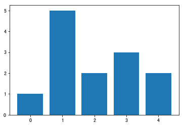
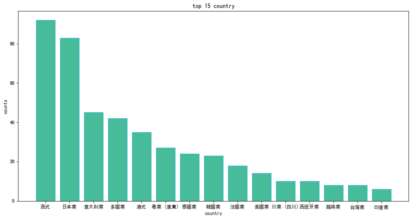
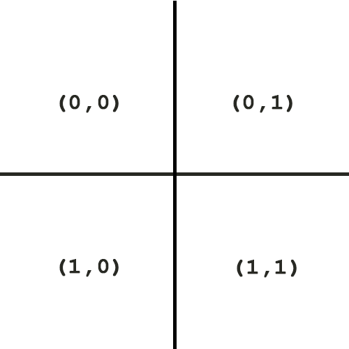

# Week 09 - Present findings: data visualization and reproducible report

<div id="toc">

<!-- TOC -->

- [Week 09 - Present findings: data visualization and reproducible report](#week-09---present-findings-data-visualization-and-reproducible-report)
    - [Objective](#objective)
    - [Data Visualization Libraries](#data-visualization-libraries)
        - [matplotlib](#matplotlib)
            - [Why matplotlib?](#why-matplotlib)
            - [Basic usage](#basic-usage)
            - [How to order the keys of bar chart](#how-to-order-the-keys-of-bar-chart)
            - [How to plot multiple chart in one input/ output cell](#how-to-plot-multiple-chart-in-one-input-output-cell)
        - [seaborn](#seaborn)
        - [plotly](#plotly)
        - [pyecharts](#pyecharts)
        - [pandas](#pandas)
        - [bokeh](#bokeh)
    - [Data visualization Principles](#data-visualization-principles)
        - [Principle](#principle)
        - [Charts](#charts)
        - [Dashboard](#dashboard)
    - [GitHub repo](#github-repo)
        - [Presenting dataset](#presenting-dataset)
        - [README.md](#readmemd)
    - [Publish work on GitHub Pages](#publish-work-on-github-pages)
        - [Basic HTML](#basic-html)
        - [Bonus: CSS](#bonus-css)
        - [Single column layout](#single-column-layout)
        - [Save plotly chart](#save-plotly-chart)
        - [Integrated exercise: Publish a full work in a stand alone page](#integrated-exercise-publish-a-full-work-in-a-stand-alone-page)
        - [Bonus: Continuously update GitHub Pages](#bonus-continuously-update-github-pages)
    - [Bonus: Craft a data service](#bonus-craft-a-data-service)
    - [Code of conduct: Reproducible reporting](#code-of-conduct-reproducible-reporting)
    - [References](#references)

<!-- /TOC -->

</div>

## Objective

- `matplotlib`
- `seaborn`
- `plotly`
- `pyecharts`
- `pandas`

## Data Visualization Libraries

Demo data: open rice data

- 1D: plot price range bars
- 2D: plot price range bars w.r.t areas
  - Use faceting, i.e. multiple sub plots in one plot
  - Use grouping, i.e. grouped bar chart (can select a subset of areas)

### matplotlib

#### Why matplotlib?

Matplotlib is a data visualization library which has ability to support you plot various kind of graphs and charts like scatter plot, bar chart, histogram, even 3D graphics and animations and so on. Its powerful and its simple that we usually use it as the basic driver for the basic data visualization.

#### Basic usage

Install and import:

```python
!pip install matplotlib
from matplotlib import pyplot as plt
```

Basic usage example:

```python
from matplotlib import pyplot as plt
data = [1, 5, 2, 3, 2]
df = pd.DataFrame(data, columns=['value'])
df
plt.bar(df.index, df.value) #pass x label value and y label value
```



#### How to order the keys of bar chart

We use the Openrice as the example to demo the visualization process, click here to download csv:

<!-- todo upload new csv -->

**Note:** Matplotlib doesn't support displaying Chinese characters, we need to do some setup work here. Please refer here with the tutorial.

```python
# -*- coding: utf-8 -*-
import pandas as pd
from matplotlib import pyplot as plt
df = pd.read_csv('openrice_viz.csv') #read csv
#df.head()

plt.rcParams['font.sans-serif']=['SimHei'] #set for displaying Chinese characters here.
plt.rcParams['axes.unicode_minus']=False #set for displaying `-`

country_counts=df['country'].value_counts()[:15].sort_values(ascending=False) #sort values
country = pd.DataFrame(country_counts)
fig = plt.figure(figsize=(14,7)) #adjust size
plt.bar(country.index, country.country,color = '#46bc99',edgecolor = '#40b4e5') #change color of the bars

# another way to plot bar in pandas:
# country_counts=df['country'].value_counts()[:15].sort_values(ascending=False).plot(
#     kind='bar',color = '#46bc99',edgecolor = '#40b4e5')
plt.title('top 15 country') #plot title and label name
plt.xlabel('country')
plt.ylabel('counts')
plt.show()
```



#### How to plot multiple chart in one input/ output cell

Sometimes, we can use `plt.subplot` function to plot multiple charts into one output cell, so that we can more easily to compare and tell the difference between different parameters.

```python
fig, axes = plt.subplots(nrows=2, ncols=2,constrained_layout=True,figsize=(30,20)) #set a 2*2 canvas, adjust layout to more flexible, adjust figure size, axes means the location of each subplots, you can refer to the following picture below to learn more.

#plot price range count, you can pass kind, color, fontsize in to the function
price = pd.DataFrame(df['price'].value_counts())
ax1 = price.plot(kind = 'bar',color = '#46bc99',edgecolor = '#40b4e5',ax=axes[0,0],fontsize=24)
ax1.set_title("Price range count",fontsize=40)

#plot country count
country = pd.DataFrame(df['country'].value_counts()[:15])
ax2 = country.plot(kind = 'bar',color = '#46bc99',edgecolor = '#40b4e5',ax=axes[0,1],fontsize=24)
ax2.set_title("Country count",fontsize=40)

#plot type count
type = pd.DataFrame(df['type'].value_counts()[:15])
ax3 = type.plot(kind = 'bar',color = '#46bc99',edgecolor = '#40b4e5',ax=axes[1,0],fontsize=24)
ax3.set_title("Type count",fontsize=40)

#plot likes and bookmark scatter
likes_bookmark = df[['likes','bookmark']]
ax4 = likes_bookmark.plot(kind = 'scatter',x='likes',y='bookmark',color = '#46bc99',ax=axes[1,1],s=80,fontsize=24)
ax4.set_title("Like with Bookmark count",fontsize=40)
```


About axes:



**Note:**


### seaborn

### plotly

### pyecharts

### pandas

<!-- TODO: run pivot table on price and area; then plot the bars inside the pandas table -->

Reference:

- [bar chart via pandas.DataFrame styling](https://pandas.pydata.org/pandas-docs/stable/style.html#Bar-charts)

### bokeh

## Data visualization Principles

### Principle

**TODO**: examples and counter examples. Where visualization helps and where visualization can go wrong. How data and viz can cheat you.

### Charts

### Dashboard

## GitHub repo

### Presenting dataset

<!-- TODO: Pili, requirement on presenting dataset -->

### README.md

"README" is a convention in computer world. You can find a file of this name in almost all software distribution. It means exactly the same as its name indicates: before you do anything, read me first! This file usually gives people instructions on first steps to work with the software. It may point to other more detailed tutorials or mannuals. The `.md` in `README.md` is just a suffix to indicate that this file is written in markdown format. When GitHub sees this file, it renders the file into HTML (for your web browser) using a markdown compiler. You can check out the [README.md](README.md) of this current repo to get an idea.

Besides giving important project information and "play the open source way", a good README file is also an "elevator pitch" to potential readers/ users. You want to present the key functions/ highlights in quick/ direct way. Here are some tips for your consideration.

- Use one sentence to summarise the project. You can use analogy to help visitors quickly comprehend the content.
- Include a "demo" section to show the outcome. Screenshots may help.
- Include a "quickstart" to show user the painless operations that can give some prelminary results.
- Include a "license" section to make the file look professional
- A [tutorial](https://blog.github.com/2018-06-29-GIF-that-keeps-on-GIFing/) to use GIFs to better present your work on GitHub.

## Publish work on GitHub Pages

### Basic HTML

- h1/ h2/ h3
- p
- img
- a
- ul/ ol/ li
- strong, em
- iframe

### Bonus: CSS

### Single column layout

### Save plotly chart

### Integrated exercise: Publish a full work in a stand alone page

<!-- TODO: show the whole workflow -->

### Bonus: Continuously update GitHub Pages

## Bonus: Craft a data service

Two components of the system:

- Frontend
- Backend

## Code of conduct: Reproducible reporting

## References

- First two chapters \(i.e. before "3D"\) of the article [The Art of Effective Visualization of Multi-dimensional Data](https://towardsdatascience.com/the-art-of-effective-visualization-of-multi-dimensional-data-6c7202990c57) by Dipanjan Sarkar


------

If you have any questions, or seek for help troubleshooting, please [create an issue here](https://github.com/hupili/python-for-data-and-media-communication-gitbook/issues/new)
