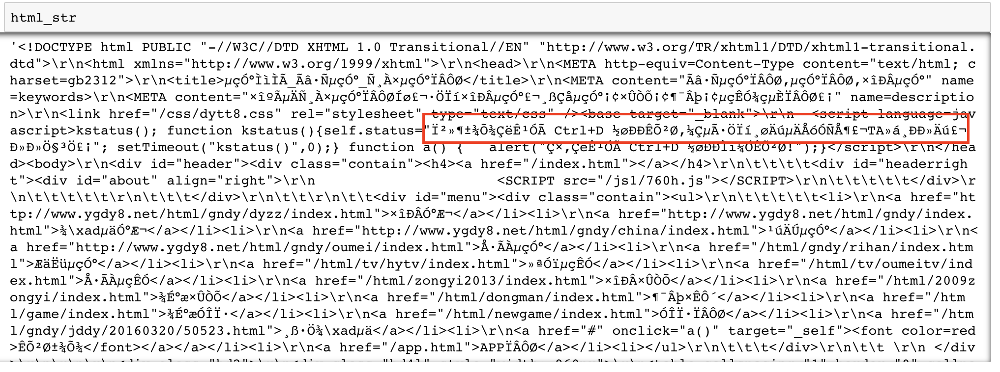
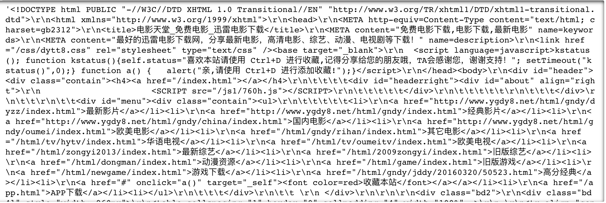
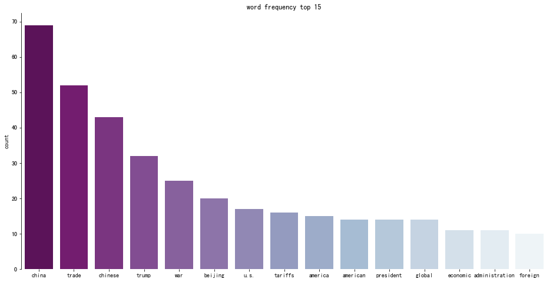

# Week 10: Text data

<div id="toc">

<!-- TOC -->

- [Week 10: Text data](#week-10-text-data)
    - [Text processing](#text-processing)
        - [String functions recap](#string-functions-recap)
            - [Case 1: Get full URL from HTML A tag's href attribute](#case-1-get-full-url-from-html-a-tags-href-attribute)
            - [Case 2: Substring matching and substitution](#case-2-substring-matching-and-substitution)
            - [Case 3: Most frequent names in tweets](#case-3-most-frequent-names-in-tweets)
        - [encode and decode](#encode-and-decode)
        - [String matching and Regular Expression (RegEx)](#string-matching-and-regular-expression-regex)
            - [Bonus: Text substitution](#bonus-text-substitution)
            - [RegEx in shell](#regex-in-shell)
    - [Word frequency](#word-frequency)
        - [Visualize word frequency](#visualize-word-frequency)
            - [with bar chart](#with-bar-chart)
            - [with tag cloud](#with-tag-cloud)
    - [Word segmentation](#word-segmentation)
        - [jieba for Chinese](#jieba-for-chinese)
        - [How to add new terms to the wordseg dictionary](#how-to-add-new-terms-to-the-wordseg-dictionary)
        - [How to adjust term weight in the wordseg dictionary](#how-to-adjust-term-weight-in-the-wordseg-dictionary)
    - [Bonus: TF.IDF](#bonus-tfidf)
    - [Bonus: Topic model](#bonus-topic-model)
    - [Bonus: Sentiment analysis](#bonus-sentiment-analysis)
    - [Bonus: word2vec](#bonus-word2vec)
    - [Text](#text)
    - [Check the information in terminal](#check-the-information-in-terminal)
    - [Simple steps to start Jupyter notebook in terminal](#simple-steps-to-start-jupyter-notebook-in-terminal)
        - [4 Steps](#4-steps)
        - [New](#new)
        - [Install modules in jupyter](#install-modules-in-jupyter)
    - [For loop](#for-loop)
        - [Range\(\)](#range\\)
        - [Append VS Extend](#append-vs-extend)
    - [Verify every step -splinter python](#verify-every-step--splinter-python)
        - [Fail to save content](#fail-to-save-content)
        - [Resolution splinter](#resolution-splinter)
        - [Save time](#save-time)
        - [Calculate the frequent terms](#calculate-the-frequent-terms)
            - [Get text](#get-text)
            - [Word count](#word-count)
    - [Further readings](#further-readings)

<!-- /TOC -->

</div>

<!-- NOTE: new outline begin -->

## Text processing

### String functions recap

Outline:

- split
- replace
- join
- format
- find
- slicing (`:`)

#### Case 1: Get full URL from HTML A tag's href attribute

Scraping Initiumlab articles' urls, which we used as an example in [chapter 5](https://github.com/hupili/python-for-data-and-media-communication-gitbook/blob/master/notes-week-05.md#scrape-all-articles-of-one-page)

* Using `split + slice + format`

When scrape certain elements in webpage, the elements sometimes are folded or shorted, we need to split to different parts, use list slicing to get the part we want and re-format the strings we want.  For example:


the article url we get is `"../../../blog/20160730-mediawiki-wiki-knowledge-management-system/"`, but what we expect is this`"http://initiumlab.com/blog/20160730-mediawiki-wiki-knowledge-management-system/"`. We can format the new string by the following method.

```python
string = "../../../blog/20160730-mediawiki-wiki-knowledge-management-system/"
s = string.split('/blog')
#s
s1 = s[-1]
#s1
s2='{0}{1}'.format('http://initiumlab.com',s1)
#s2
```

#### Case 2: Substring matching and substitution

Check out certain words in a string, replace certain words and separate the words with some notations.

* Using `find + replace + join`

In certain occasion, we need to check out whether there is one word in the string, and need to replace the word.

```python
str = "this is string example....this is the string we will test, is it"
str.find('string')
#output: 8, the position of the first characters
str.find('python')
#output: -1, it will return -1 if there is no this word in the string
str.replace("is", "was") #replace all
#output: 'thwas was string example....thwas was the string we will test, was it'
str.replace("is", "was", 3) #replace first 3
#output: 'thwas was string example....thwas is the string we will test, is it'
s3 = str.split(' ')
'|'.join(s3) #you can add different things in the string
#output: 'this|is|string|example....this|is|the|string|we|will|test,|is|it'
```

#### Case 3: Most frequent names in tweets

Apply a function onto every element of the dataframe - Check out the most frequent names in the tweets text

* Using `str.lower()` + `in` operator + `pandas.apply()`

Exercise with the Tweeter Troll Data, you can download [here](https://raw.githubusercontent.com/hupili/python-for-data-and-media-communication/master/text-analysis/regular_reader_tweets.csv).

1. Check out times that certain name appears in the dataset.

```python
#import and check out the dataset
import pandas as pd
df = pd.read_csv('regular_reader_tweets.csv')
#len(df)
#df.sample(10)

#check certain user name in the text
def check_name(x):
    return 'ten_gop' in str(x).lower()
df['text'].apply(check_name).value_counts()
#return results true only
#df['text'].apply[check_names].value_counts()[True]
```

Output:

```text
False    202991
True        491
Name: text, dtype: int64
```

2. Check out the most common names in the tweet text.

```python
# filter out all the user and reset to dataframe
s_user = df['user_key'].value_counts()
df_users = s_user.reset_index()
#df_users

# count_retweeted_number of all the users with apply function
def count_retweeted_number(name):
    def check_name(x):
        return name in str(x).lower()
    return df['text'].apply(check_name).value_counts().get(True, 0)

df_users['count'] = df_users['index'].apply(count_retweeted_number)
df_users.sort_values(by='count', ascending=False)
```

Output:


### encode and decode

- UTF-8
- GBK

`UTF-8` is the most widely used implementation of Unicode on the Internet, while `GBK` is mainly used for coding Chinese character.

For example, scraping Chinese websites like `电影天堂`.

```python
url = 'https://www.dytt8.net/'
r = requests.get(url)
html_str = r.text
```



You will find the results is messy because the website is using `gb2312` method to encode the html, which is kind of `GBK` methods.


Therefore, we need to firstly decode the content.

```python
html = r.content.decode('gbk')
html
```

After decoding, the Chinese characters can display appropriately. And when saving the data, you can use a more widely used method `utf-8` to encode it.

```python
with open('dy.csv','a',newline='',encoding='utf-8') as csvfile
```



### String matching and Regular Expression (RegEx)

The `.find()` and `in` operator on `str` has limited matching capability. They can only perform precise matching. What if we want to do fuzzy matching? Common siutations:

1. Find all the user names from the Twitter message. i.e. those look like `@xxxx `, i.e. start with `@` and end with ` ` (blank).
2. Find all the phone numbers from a paragraph of texts.

RegEx can solve those problems in a very concise way.

<!-- TODO: solve above two problems using RegEx -->

#### Bonus: Text substitution

RegEx can let you substitute some matching parts. It even allows to interpolate variables using values from matching part.

#### RegEx in shell

Following commands can be used to perform RegEx operation. Those commands sometimes can make your work more efficient.

- `grep`
- `egrep`
- `fgrep`


## Word frequency

### Use dict to count the words frequency

```python
list = meaningful_words #the list of words you have
dict_words_frequency={}
for n in list:
    dict_words_frequency[n]=list.count(n)
#dict_words_frequency
```

### Use pandas.series.value_counts()

Use the [assignment 1](https://github.com/hupili/python-for-data-and-media-communication-gitbook/blob/master/assignments.md#assignment-0----bridging-assignment-for-language-efficiency) as an example:

```python
import os
import pandas as pd
  
def read_txt(path): #read files and get content
    all_text = []
    for file in os.listdir(path):
        f=open(file,"r+",encoding="utf8")
        contents= f.read()
        all_text.append(contents)
    all_words = "".join(all_text)
    for ch in '\s+\.\!\/_,$%^*(+\"\')]+|[+——()?:【】“”‘’！，。’':
        words = all_words.replace(ch," ")
    return words

def stopwordslist(filepath):   #set stopwords
    stopwords = [line.strip() for line in open(filepath, 'r', encoding='utf-8').readlines()]  
    return stopwords

def remove_stopwords(words): #remove stopwords
    processed_word_list = [] 
    for word in words:
        word = word.lower() # in case they are not all lower cased
        if word not in stopwords:
            processed_word_list.append(word)
    return processed_word_list

words = read_txt("text/")
words = words.split()
stopwords = stopwordslist('./stopwords_eng.txt')
stopwords = set(stopwords)
processed_word_list = remove_stopwords(words)
word_count = pd.Series(processed_word_list).value_counts().sort_values(ascending=False)[0:15]
```

Output:

```text
china             69
trade             52
chinese           43
trump             32
war               25
beijing           20
u.s.              17
tariffs           16
america           15
american          14
president         14
global            14
economic          11
administration    11
foreign           10
```

### Visualize word frequency

#### with bar chart

```python
#you can use other visualization library
import seaborn as sns
import matplotlib.pyplot as plt 
def word_count(processed_word_list):
    word_count = pd.Series(processed_word_list).value_counts().sort_values(ascending=False)[0:15]  
    fig = plt.figure(figsize=(16,8))  
    x = word_count.index.tolist()  
    y = word_count.values.tolist()  
    sns.barplot(x, y, palette="BuPu_r")  
    plt.title('word frequency top 15')  
    plt.ylabel('count')  
    sns.despine(bottom=True)  
    #plt.savefig('./word_count_bar.png',dpi=400)  
    plt.show()

word_count(processed_word_list)
```



#### with tag cloud

Tag cloud is commonly used, for aesthetics purpose. However, it is not a precise presentation of the data.

```python
from PIL import Image
import wordcloud
import numpy as np

def tag_cloud(text):
    mask = np.array(Image.open('newspaper.png')) #set mask, you can change to the picture you like, but it must have a high color contrast
    wc = wordcloud.WordCloud(mode='RGBA',background_color='white',max_words=2000,stopwords=stopwords,max_font_size=300,random_state=42,mask=mask)
    wc.generate_from_text(' '.join(text))
    plt.figure(figsize=(12,12))
    plt.imshow(wc, interpolation='bilinear')
    plt.axis("off")
    plt.title('word frequency top 15 tag cloud', loc='Center', fontsize=20)
    plt.show()
    return plt.show()

tag_cloud(words)
```


## Word segmentation

### jieba for Chinese

For english words, its easy to segment words, just by the blank space between the words. But for Chinese words, its more complicated, because there is no blank space in Chinese sentence and the combination of the characters in one sentences may diverse too. In order to handle this situation, `jieba` is the most useful libraries we can get out here, which is a Chinese specialized word segmentation module.

Install and import:

```python
!pip3 install jieba
import jieba
```

Basic usage:

```python
s = '我在浸会大学学python'
jieba.cut(s)
#output: <generator object Tokenizer.cut at 0x10f3a3048>
list(jieba.cut(s)) #turn it into list
#['我', '在', '浸会', '大学', '学', 'python']
```

Case1: Cut an article, you can download the article [here](assets/trade-wars-zh.txt).

```python
import jieba
text = open('trade-wars-zh.txt',"r").read()
#cut words
words = jieba.cut(text)
#set stopwords
filepath = 'stopwords.txt'
stopwords = [line.strip() for line in open(filepath, 'r', encoding='utf-8').readlines()]
#remove stopwords
processed_word_list = []
for word in words:
    if word not in stopwords and len(word)>1: #remove single word
        processed_word_list.append(word)

#processed_word_list
```

### How to add new terms to the wordseg dictionary

Example 1: Customize your own words dict

For basic needs, using `suggest_freq(segment, tune=True)` and `add_word(word)` are recommended.

```python
print('/'.join(jieba.cut('特朗普已经准备好对所有进口美国的中国商品征收关税')
#中国/已/表示/计划/对/美国/的/任何/贸易壁垒/进行/报复/。
jieba.suggest_freq(('贸易', '壁垒'), True)
print('/'.join(jieba.cut('中国已表示计划对美国的任何贸易壁垒进行报复。')))
#中国/已/表示/计划/对/美国/的/任何/贸易/壁垒/进行/报复/。
jieba.add_word('贸易壁垒')
print('/'.join(jieba.cut('中国已表示计划对美国的任何贸易壁垒进行报复。')))
#中国/已/表示/计划/对/美国/的/任何/贸易壁垒/进行/报复/。
```

Example 2: Ambiguous word segmentation

1. 如果 & 果汁

```python
s1 = '狮子山的山泉水如果汁一般好喝'
'/'.join(jieba.cut(s1))
#'狮子山/的/山泉水/如果/汁/一般/好喝'
jieba.suggest_freq(('如', '果'), True)
'/'.join(jieba.cut(s1))
#'狮子山/的/山泉水/如/果汁/一般/好喝'
```

2. 乒乓球拍 卖完了& 乒乓球 拍卖完了

```python
s2 = '乒乓球拍卖完了'
'/'.join(jieba.cut(s2))
#'乒乓球/拍卖/完/了'
jieba.add_word('乒乓球拍')
jieba.suggest_freq(('拍', '卖'), True)
#'乒乓球拍/卖完/了'
```

For a complicated cases, you can refer [here](https://blog.csdn.net/qq_30262201/article/details/80128076) to customize your own words dict.

### How to adjust term weight in the wordseg dictionary

## Bonus: TF.IDF

- Term Frequency
- Inverse Document Frequency

## Bonus: Topic model

<!-- TODO: -->

## Bonus: Sentiment analysis

- Construct classifier using `sklearn`.
- Online API like [text-processing](http://text-processing.com/docs/sentiment.html).
- `TextBlob` is also useful and applied in [group 2's work](https://dnnsociety.org/2018/03/02/using-big-data-to-figure-out-how-fair-china-daily-news-is/).

## Bonus: word2vec


----------------------

Following content is from week7 of S18 offering. Unorganised yet.

## Text

## Check the information in terminal

* `which pip3`is to learn where is pip3 in your computer. You can also input `which pip`to know the location of pip.

* `ls -l` means to list the files in the mode of listing with details.  
    
  From the above screenshot, you can find that Python equals to python3.6 and the same as python3. Pip does not equal to pip3.

* `cat` to check the content to verify if they are the same.  
    
  Obviously, they are the same.

* You can also drag the pip file and pip3 file into the Visual Studio Code,after you use `which` to know their location.

## Simple steps to start Jupyter notebook in terminal

### 4 Steps

* Step1  
  `pyvenv venv` means create a virtual environment\(venv\) folder called 'venv'. You can change the folder's name as you like, like `pyvenv BIGDATA`.  
    Be careful where you create the folder.

* Step2  
  `source venv/bin/activate` means activate the virtual environment. Then you will see the '\(venv\)',which means you are in a virtual environment.  
    
  You can `deactivate` the virtual environment.

* Step3

  ```
  pip install jupyter
  pip install requests
  ```

* Step4  
  `Jupyter notebook` to open notebook.

### New

* If you are in the same computer, or on your own laptop, you don't need to totally follow the 4 steps.

* Pili's virtual environment folder is 'environment'. So if he restart his computer, he can just

  ```
  source enviroment/bin/activate
  Jupyter notebook
  ```

  

### Install modules in jupyter

* You can just pip install packages in jupyter notebook.
  

## For loop

### Range\(\)

* Function 'Range' has 3 parameters. From XX to XX with the step size XX.  
  The 3rd parameter is the step size. If you don't input the 3rd one, it will take 1 in default.
   

*  The parameters can be negative.
    
  

* 'i' is defined in the whole coding,from the beginning of 'import' to the end of the coding, not only inside for loop.

* If you define sth inside the `def`, the definition will only work inside the def.

### Append VS Extend


* In the for loop, i will be 10, 8 then 6 and 4 at last. Only the last value is left.


* `append` means add. Every time you have an 'i', you add it into the 'pages' list.


* `append` means that the whole list is appended as an element, or one item.

* `extend` means extract the items and add those items into the new list.

## Verify every step -splinter python

### Fail to save content


```
r=requests.get('XXXXthe website')
```
The above step is OK.

```
 r.text
 open('mypage','w').write(r.text)
```

* Then you can find a file.  

  
If you open it, you will find that
  
It is blank, which means the file you save is blank.  
SO try to verify everything step by step.

### Resolution splinter

Splinter is a browser to emulate a real person. So the website won't know whether you are a man or a robot.  


You can google to learn that.


### Save time

* You can interrupt it.  
    
  

* You can run the top20.  
    
  

### Calculate the frequent terms

#### Get text

   
    
    
 Get the text.

  ```
  .split()
  ```
  
    
    
    
  Split by space or comma.

  ```
  [:10]
  ```

    
  Get the formal 10 items' text.

  ```
  extend()
  ```

    
  Split the formal 5 items' text and split them by space. Then extract the items and add the items into list 'all\_text'.

*  If we run for whole text, cancelling '\[:5\]'. There is an error.  
    
   We have to change the text into str.

#### Word count

    
  

  ```
  pd.Series()
  ```

    
    
  Convert 'word count' into a Series, and reset index.

  ```
  .to_frame().reset_index()
  ```

    
  Convert into a dataframe.

  ```
  sort_values(ascending=False)
  ```

    
  They are not informative, as there are so many 'stop-words'. We can delete those words manually.

  ```
  set(['RT', 'the', 'of'])
  ```

    
  `set` is more efficient for the integers to check in or not in.

* You can search google you can find 'stop word' resources.

* NLTK:   
  

## Further readings

1. [Unicode, ASCII,UTF-8 and GBK](https://jdhao.github.io/2018/01/28/unicodede-utf8-gbk/)

------

If you have any questions, or seek for help troubleshooting, please [create an issue here](https://github.com/hupili/python-for-data-and-media-communication-gitbook/issues/new)
