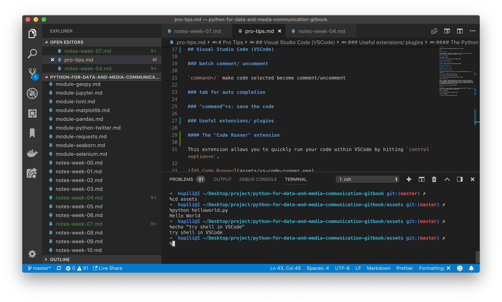

# Pro Tips

Good use of hotkeys and shorthands can boost your efficiency.

## Shell

### auto completion

Use "Tab" button. For example,  type "python ev", then use "Tab", you can see the "python evening.py" \(assume the file name is evening\)

### find last command

Use upward arrow key.

Try `control+r` to conduct a search in command history.

## Visual Studio Code (VSCode)

### batch comment/ uncomment codes

`command + /` make code selected become comment/ uncomment. This hotkey can give proper comment blocks according to the current languaged identified by VSCode. For example, Python scripts will see `#` prefixed lines as comment blocks. markdown/ HTML files will see `<!-- comment -->` style blocks.

### tab for auto completion

### "command"+s: save the code

### Run shell commands inside VSCode window

You don't have to leave VSCode in order to run Python scripts.

### Useful extensions/ plugins

#### The "Code Runner" extension

This extension allows you to quickly run your code within VSCode by hitting `control+option+n`.

This is equivalent by executing your code from the Terminal.

#### The Python linter

Python is a dynamic language which makes error checking at compile time hard. Most error is exposed at run time. However, some tools can still help us to catch most of the errors and try to write best practice code. "Linting" is a general concept found in all programming languages that refers to the process to identify potential errors and suboptimal practices at the writing time.

The `ms-python.python` plugin may be useful.

## Chrome

The `JSONView` extension can help to structure and highlight JSON. In this way, it is easier to read the JSON response from common APIs.

Before using JSONView:

After using JSONView:

